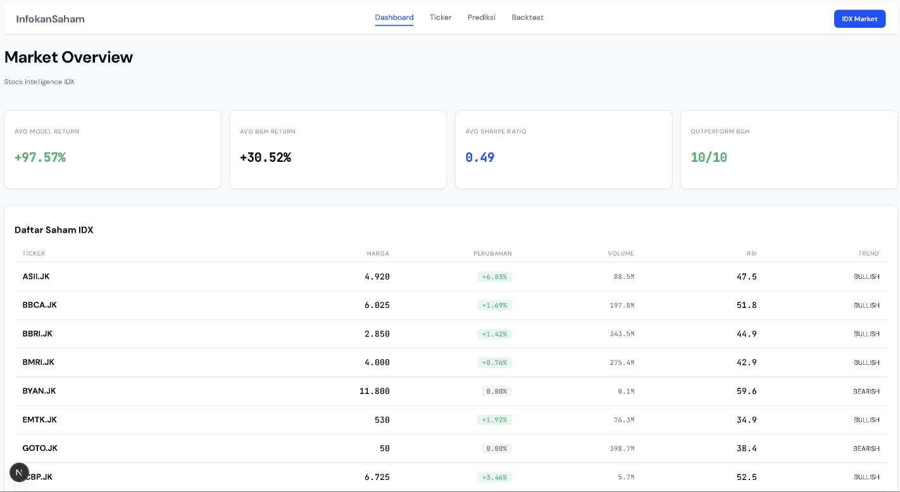
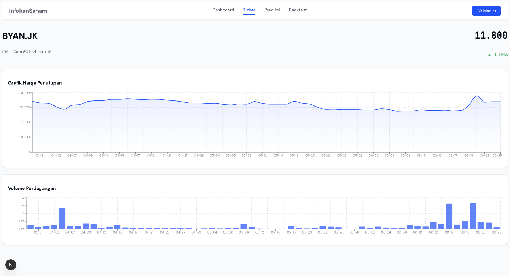
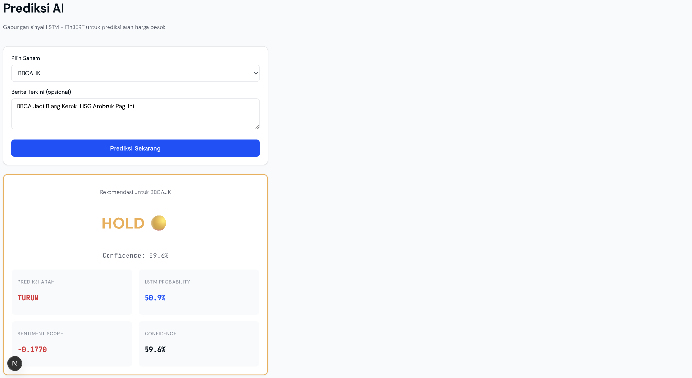
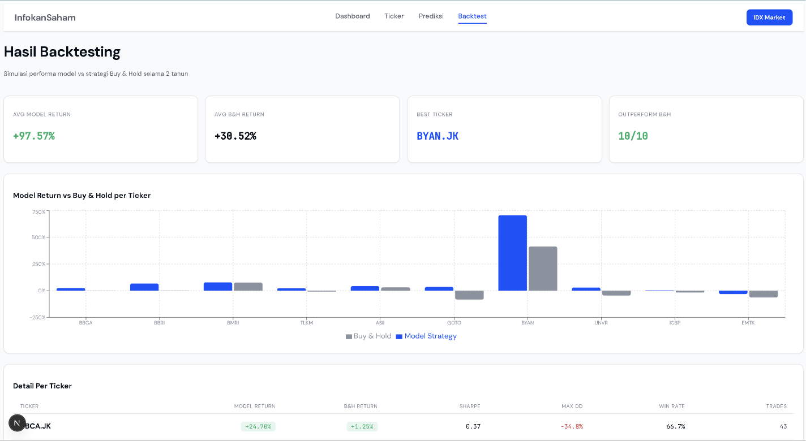

# InfokanSaham 


## Overview

InfokanSaham is an end-to-end machine learning system for Indonesian stock market (IDX) intelligence. The platform combines time-series price modeling with NLP-based news sentiment analysis to generate directional predictions for 10 actively traded IDX equities.

This project covers the full ML engineering lifecycle: data ingestion, feature engineering, model training, backtesting, REST API serving, and a production-style web dashboard — built as a portfolio capstone for an AI/ML Engineer position.



 


**Backtesting Results (5-Year Simulation):**

| Metric | Value |
|---|---|
| Average Model Return | +97.57% |
| Average Buy & Hold Return | +30.52% |
| Tickers Outperforming B&H | 10 / 10 |
| Best Performing Ticker | BYAN.JK (+706%) |

---

## System Architecture

```
Data Sources
  Yahoo Finance (OHLCV)
  NewsAPI (financial articles)
  Google News RSS (local news)
  GDELT Project (geopolitical events)
        |
        v
Data Pipeline (Python scripts)
        |
        v
TimescaleDB (PostgreSQL time-series storage)
        |
        v
Feature Engineering
  Technical Indicators: RSI, MACD, Bollinger Bands, ATR, OBV, VWAP
  Sentiment Scores: FinBERT inference on news text
        |
        v
Model Training (PyTorch)
  Model 1 — LSTM: price direction classification
  Model 2 — FinBERT: news sentiment fine-tuning
  Model 3 — Ensemble: logistic regression over LSTM + FinBERT outputs
        |
        v
Backtesting Engine
  Strategy comparison: Model vs Buy & Hold
  Metrics: Return, Sharpe Ratio, Max Drawdown, Win Rate
        |
        v
FastAPI (REST API serving)
        |
        v
Next.js Dashboard (web interface)
```

---

## Models

| Model | Type | Task | Performance |
|---|---|---|---|
| LSTM | Binary Classifier | Predict price direction (up/down) | 62% accuracy, macro F1: 0.51 |
| FinBERT | Sequence Classifier | News sentiment (positive/neutral/negative) | Fine-tuned on IDX news corpus |
| Ensemble | Logistic Regression | Combine LSTM proba + sentiment score | 63% accuracy |

**Note on performance:** A 62% directional accuracy is considered competitive for equity price prediction. The primary limitation is the scarcity of manually-labeled Indonesian financial news data. In a production setting, the sentiment labels would be curated by domain experts rather than inferred from a US-trained pretrained model.

---

## Tech Stack

### Machine Learning
- PyTorch — LSTM architecture with BCEWithLogitsLoss and class weighting
- HuggingFace Transformers — FinBERT fine-tuning (ProsusAI/finbert)
- Scikit-learn — Ensemble model, StandardScaler, evaluation metrics
- TA-Lib (ta) — RSI, MACD, Bollinger Bands, ATR, OBV, VWAP

### Data & Storage
- TimescaleDB — time-series optimized PostgreSQL via Docker
- DVC — data and model artifact versioning
- yfinance — OHLCV historical price data
- feedparser — Google News RSS ingestion
- NewsAPI — financial news articles

### MLOps
- MLflow — experiment tracking and model registry
- Apache Airflow — pipeline scheduling (Dockerized)
- Docker & Docker Compose — full service containerization

### Backend & Frontend
- FastAPI — async REST API with Pydantic validation and Swagger docs
- Next.js 14 — React-based frontend with App Router
- Recharts — interactive financial charts
- Axios + TanStack Query — API client and server state management

---

## Project Structure

```
InfokanSaham/
├── data/
│   ├── raw/
│   │   ├── ohlcv/              # Sample OHLCV data (500 rows)
│   │   ├── news/               # Sample news articles
│   │   └── gdelt/              # Sample GDELT events
│   └── processed/              # Sample featured dataset
├── pipelines/
│   ├── fetch_ohlcv.py          # Yahoo Finance ingestion
│   ├── fetch_news.py           # NewsAPI ingestion
│   ├── fetch_yfinance_news.py  # Yahoo Finance news ingestion
│   ├── fetch_gdelt.py          # GDELT ingestion
│   └── export_samples.py       # Export DB samples to CSV
├── notebooks/
│   └── 01_EDA.ipynb            # Feature engineering and EDA
├── models/
│   ├── prepare_data.py         # Sequence generation and train/test split
│   ├── train_lstm.py           # LSTM training with MLflow tracking
│   ├── train_finbert.py        # FinBERT fine-tuning
│   ├── train_ensemble.py       # Ensemble training
│   ├── backtest.py             # Backtesting engine
│   └── artifacts/              # Trained model files (DVC tracked)
├── api/
│   ├── main.py                 # FastAPI app entrypoint
│   ├── dependencies.py         # Model singleton loaders
│   └── routers/
│       ├── predict.py          # Prediction endpoint
│       ├── sentiment.py        # Sentiment analysis endpoint
│       ├── market.py           # Market data endpoints
│       └── backtest.py         # Backtest results endpoints
├── frontend/
│   ├── app/                    # Next.js App Router pages
│   ├── components/             # Reusable UI components
│   └── lib/                    # API client and type definitions
├── mlops/
│   ├── dags/                   # Airflow DAG definitions
│   ├── mlflow_setup.py         # MLflow configuration
│   └── mlflow.db               # MLflow SQLite backend
├── docker-compose.yml          # TimescaleDB + Airflow services
├── requirements.txt
├── .env.example
├── .gitignore
└── README.md
```

---

## Covered Equities

| Ticker | Company | Sector |
|---|---|---|
| BBCA.JK | Bank Central Asia | Banking |
| BBRI.JK | Bank Rakyat Indonesia | Banking |
| BMRI.JK | Bank Mandiri | Banking |
| TLKM.JK | Telkom Indonesia | Telecommunications |
| ASII.JK | Astra International | Automotive |
| GOTO.JK | GoTo (Gojek-Tokopedia) | Technology |
| BYAN.JK | Bayan Resources | Energy |
| UNVR.JK | Unilever Indonesia | Consumer Goods |
| ICBP.JK | Indofood CBP | Consumer Goods |
| EMTK.JK | Elang Mahkota Teknologi | Media |

---

## Prerequisites

- Python 3.10+
- Docker and Docker Compose
- Node.js 18+
- Git

---

## Setup & Installation

### 1. Clone the repository

```bash
git clone https://github.com/USERNAME/InfokanSaham.git
cd InfokanSaham
```

### 2. Configure environment variables

```bash
cp .env.example .env
# Fill in your API keys in .env
```

### 3. Create Python virtual environment

```bash
python -m venv venv
source venv/Scripts/activate  # Windows
# source venv/bin/activate    # macOS/Linux
pip install -r requirements.txt
```

### 4. Start infrastructure services

```bash
docker compose up -d
```

This starts TimescaleDB (port 5432) and Apache Airflow (port 8080).

### 5. Initialize database schema

```bash
docker exec -it timescaledb psql -U postgres -d stockdb
```

Run the SQL schema from `mlops/schema.sql`, then exit.

### 6. Ingest data

```bash
python pipelines/fetch_ohlcv.py
python pipelines/fetch_news.py
python pipelines/fetch_yfinance_news.py
python pipelines/fetch_gdelt.py
```

### 7. Feature engineering

Open and run all cells in `notebooks/01_EDA.ipynb`.

### 8. Train models

```bash
python models/prepare_data.py
python models/train_lstm.py
python models/train_finbert.py
python models/train_ensemble.py
```

### 9. Run backtesting

```bash
python models/backtest.py
```

### 10. Start the API server

```bash
uvicorn api.main:app --reload --port 8000
```

API documentation available at `http://localhost:8000/docs`.

### 11. Start the frontend

```bash
cd frontend
npm install
npm run dev
```

Dashboard available at `http://localhost:3000`.

---

## API Endpoints

| Method | Endpoint | Description |
|---|---|---|
| POST | `/predict/` | Get price direction prediction for a ticker |
| POST | `/sentiment/` | Analyze sentiment of a news text |
| GET | `/market/tickers` | List all available tickers |
| GET | `/market/summary` | Get market summary for all tickers |
| GET | `/market/ohlcv/{ticker}` | Get OHLCV data for a ticker |
| GET | `/backtest/results` | Get backtesting results per ticker |
| GET | `/backtest/summary` | Get aggregated backtesting summary |

---

## Service URLs

| Service | URL | Credentials |
|---|---|---|
| Web Dashboard | http://localhost:3000 | — |
| API (Swagger) | http://localhost:8000/docs | — |
| MLflow UI | http://localhost:5000 | — |
| Airflow UI | http://localhost:8080 | admin / admin123 |

---

## Data

Sample data is available in `data/raw/` for reference and reproducibility. Full datasets are stored in TimescaleDB and can be reproduced by running the ingestion scripts.

Data sources are entirely free and publicly accessible — no paid subscriptions required for development.

---

## Known Limitations

- **Sentiment data quality:** FinBERT was pretrained on English US financial news. Indonesian news headlines tend to be more neutral and factual in tone, causing a strong class imbalance toward the neutral label. Manual labeling by a domain expert would significantly improve sentiment signal quality.
- **Model accuracy:** At 62%, the LSTM model provides a statistically meaningful edge over random (50%) but is not suitable for live trading without additional risk controls.
- **No broker integration:** This system produces signals only. It is not connected to any brokerage API and does not execute trades.
- **Data volume:** IDX-specific news coverage in English is limited. A larger Indonesian-language corpus would improve both sentiment modeling and directional prediction.

---

## Future Work

- Fine-tune a dedicated Indonesian financial sentiment model using manually labeled data
- Add real-time data ingestion with scheduled Airflow DAGs (infrastructure already in place)
- Integrate position sizing and risk management into the backtesting engine
- Expand coverage to all LQ45 constituents
- Add walk-forward validation to reduce look-ahead bias in backtesting

---

## License

This project is intended for educational and portfolio purposes.
